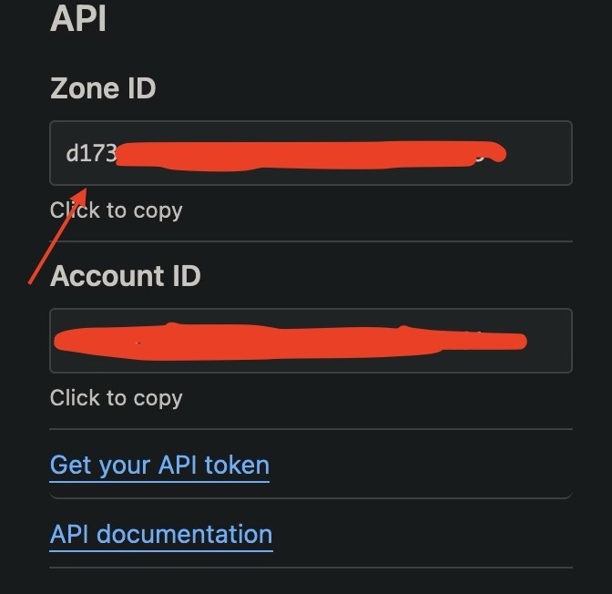
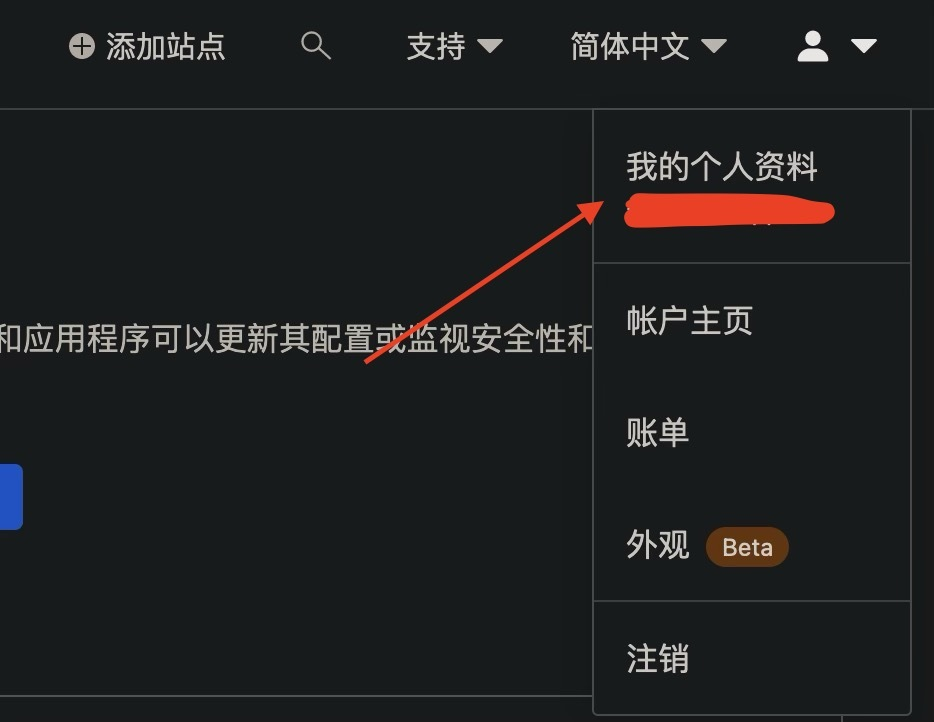
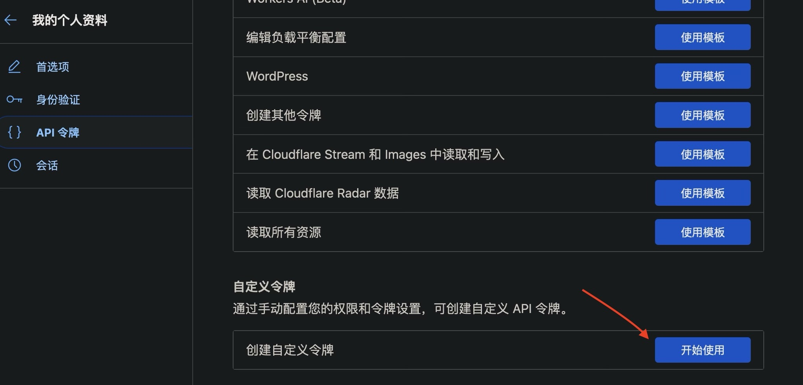
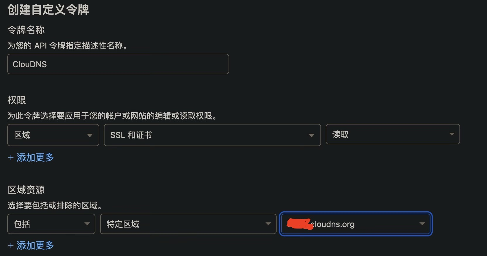
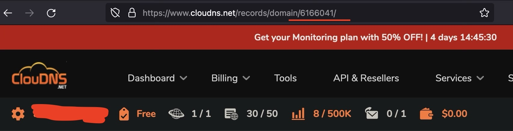

### ClouDNS-No！
自动续期托管在 Cloudflare 上的 ClouDNS 域名的边缘证书。

#### 功能：
1. 自动通过ClouDNS的hCaptcha验证，获取Session cookie
2. 自动查询Cloudflare的TXT记录并添加
3. 添加记录后检测证书申请状态（6小时），如已申请成功则删除记录
4. 每月1日定时运行一次程序，可自行修改
5. 自动上传屏幕录像，方便排查错误

#### 使用方法：
##### 一. 获取 Cloudflare 区域ID & 令牌
1. 进入 Cloudflare 控制面板，选择你的 ClouDNS 域名，复制概述右下角的区域ID；

2. 点击右上角用户图标，选中我的个人资料；

3. 点击左侧栏的 “API 令牌”，创建一个新的令牌；

4. 下滑到下方的创建自定义令牌选项；

5. 根据下图配置创建新的令牌，并保存令牌内容。

##### 二. 获取 ClouDNS 区域ID
登录 ClouDNS，进入你的域名DNS设置界面，此时地址栏 `domain` 后的数字即为你的域名区域ID。

##### 三、注册 hCaptcha 无障碍帐号
根据[此篇教程](https://blog.skk.moe/post/bypass-hcaptcha/)内容，注册 hCaptcha 无障碍帐号，并保存注册链接（即`https://accounts.hcaptcha.com/verify_email/xxxxxxxx-xxxx-x4xx-xxxx-xxxxxxxxxxxx`）。

##### 四、设置 Github Actions 权限和变量
Fork 本项目，点击上方 Settings，进入 Code and automation - Actions - General 界面，将下方 Workflow permissions 设为 Read and write permissions。

然后进入 Security - Secrets and variables - Actions 界面，添加以下 Repository secrets：
- `CF_TOKEN`：你的Cloudflare令牌
- `CF_ZONE_ID`：你的Cloudflare区域ID
- `CD_EMAIL`：你的ClouDNS登录邮箱
- `CD_PASSWD`：你的ClouDNS登录密码
- `CD_ZONE`：你的ClouDNS区域ID
- `HC_LINK`：你的hCaptcha注册链接

最后启用Actions，手动运行一次Workflow即可。

#### 鸣谢：
- [如何绕过烦人的 hCaptcha & Cloudflare Captcha](https://blog.skk.moe/post/bypass-hcaptcha/)
- [hcaptcha-bypass-discord](https://github.com/avengy/hcaptcha-bypass-discord)
- [Auto-rerun github workflow on failure](https://github.com/orgs/community/discussions/67654)